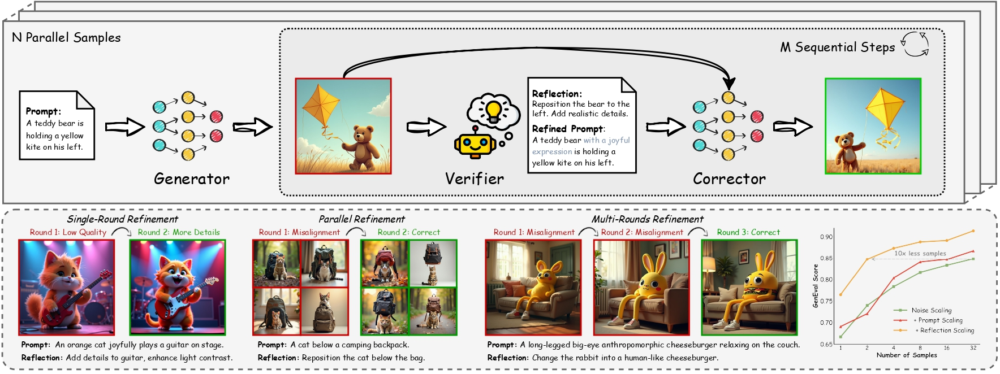

<div align="center" style="font-family: charter;">
<h1><i>From Reflection to Perfection:</i>:</br>Scaling Inference-Time Optimization for Text-to-Image Diffusion Models via Reflection Tuning</h1>


<a href="tmp" target="_blank">
    </a>
<a href="https://liangbingzhao.github.io/reflection2perfection/" target="_blank">
    </a>
<a href="https://huggingface.co/collections/diffusion-cot/reflectionflow-release-6803e14352b1b13a16aeda44" target="_blank">
    </a>

<div>
    <a href="https://le-zhuo.com/" target="_blank">Le Zhuo</a><sup>1,</sup><sup>4</sup>,</span>
    <a href="https://liangbingzhao.github.io/" target="_blank">Liangbing Zhao</a><sup>2</sup>, </span>
    <a href="https://sayak.dev/" target="_blank">Sayak Paul</a><sup>3</sup>,</span>
    <a href="https://liaoyue.net" target="_blank">Yue Liao</a><sup>1</sup>,</span>
    <a href="https://zrrskywalker.github.io/" target="_blank">Renrui Zhang</a><sup>1</sup>,</span>
    <a href="https://synbol.github.io/" target="_blank">Yi Xin</a><sup>4</sup>,</span>
    <a href="https://gaopengcuhk.github.io/" target="_blank">Peng Gao</a><sup>4</sup>,</span>
    <a href="https://cemse.kaust.edu.sa/profiles/mohamed-elhoseiny" target="_blank">Mohamed Elhoseiny</a><sup>2</sup>, </span>
    <a href="https://www.ee.cuhk.edu.hk/~hsli/" target="_blank">Hongsheng Li</a><sup>1</sup></span>
</div>


<div>
    <sup>1</sup>CUHK MMLAB&emsp;
    <sup>2</sup>KAUST&emsp;
    <sup>3</sup>Hugging Face&emsp;
    <sup>4</sup>Shanghai AI Lab&emsp;
</div>




<h align="justify">Overall pipeline of the <strong>ReflectionFlow</strong> framework with qualitative and quantitative results of scaling compute at inference time.</h>

</div>      

## :fire: News

- [2025/4/18] Release [paper](tmp).
- [2025/4/05] Release GenRef dataset, as well as the training and evaluation code.

## ✨ Quick Start  

### Installation

Coming soon.

## 🚀 GenRef Dataset

### Introduction

Coming soon.

### Evaluation on VLM

Coming soon.

### Evaluation on LMM

Coming soon.


## 🤖 Reflection Tuning
Coming soon.

## ⚡ Inference Time Scaling
Coming Soon

## 🤝 Acknowledgement

We are deeply grateful for the following GitHub repositories, as their valuable code and efforts have been incredibly helpful:
 
Coming Soon.

## ✏️ Citation

If you find ReflectionFlow useful for your your research and applications, please cite using this BibTeX:

```bibtex
tmp
```